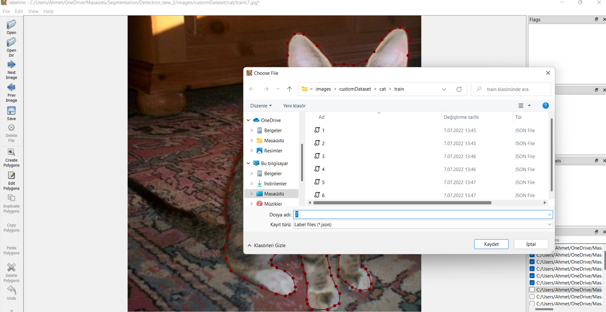
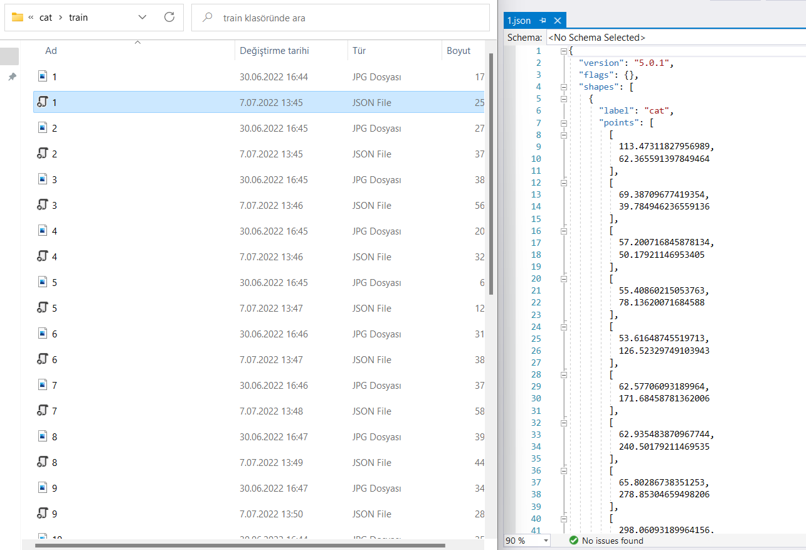

# Detectron2

Bu projede yapılanlar;

<aside>
📖 Bu projede yapılanlar;
<br>1- detectron2 ve LabelMe kurulumu</br>
<br>2-LabelMe programında etiketlenen resimlerle modelimizin kurulması yani ilk projemiz</br>
<br>3-İlk projemizde ortaya çıkan sorun ve ikinci bir projede bu sorunun çözümünün gösterilmesi</br>

</aside>

<aside>
📖 detectron2 ile modelin kurulması ve açıklanması “ilk projemizde” gösterilecektir.

</aside>

---

- **1-detectron2**
    
    
    Detectron2 Facebook tarafından açık kaynak hale getirilmiş object detection ve segmantation gibi yapay zeka algoritmalarını içeren bir kütüphanedir. Gücünü de PyTorch’tan almaktadır.
    
    [GitHub - facebookresearch/detectron2: Detectron2 is a platform for object detection, segmentation and other visual recognition tasks.](https://github.com/facebookresearch/detectron2)
    
    - **detectron2 kurulması**
        
        Önemli : Cuda ve Pytorch versiyonu çakışmaması gerekir. 
        Temiz kurulum için “anaconda” da sanal ortam oluşturuyoruz ve ortamımızı hazırlıyoruz. 
        
        - **anaconda’da** sanal ortam oluşturduk ve geçiş yaptık
            
            ```python
            conda create -n XXXX python=3.8
            conda activate XXXX
            ```
            
            Cuda ve Pytorch’un çakışmayan versiyonunu kuruyoruz ve cython kütüphanesini kuruyoruz.
            
            ```python
            conda install pytorch torchvision torchaudio cudatoolkit=11.0 -c pytorch
            pip install cython
            ```
            
        - Eger ortamımız hazırsa, Klasorumuzun içine detectron2 ‘yi clone etmemiz lazım!
            
            ```python
            git clone https://github.com/facebookresearch/detectron2.git
            cd "bulunduğu klasoru aç!"
            pip install -e . #Kurulum için yapmamız lazım.
            pip install opencv-python
            
            ```
            
        - Günün sonunda 2 iş yaptık.
            - [ ]  Anaconda da ortam oluşturduk, ortamımızı hazırladık.
            - [ ]  detectron2 yi kurduk
        

---

- **2-LabelMe**
    
    LabelMe Github:
    
    [GitHub - wkentaro/labelme: Image Polygonal Annotation with Python (polygon, rectangle, circle, line, point and image-level flag annotation).](https://github.com/wkentaro/labelme)
    
    - LabelMe ile resimlerimizi kolay ama ilkel yoldan etiketlemizi sağlar.
    - Etiketlenen resimlerimizin çıktısını “json” formatında verir.
    - Her resim için ayrı bir json dosyası vardır.
    - Günün sonunda yazılan bir script ile, train ve test klasörlerindeki “json” dosyalarını birleştirir.
    
    Not : train içindeki (1,2,3….) diye olan json dosyalarımızı birleştirerek tek bir train json dosyası yapıyor. Aynı işlemi test için uyguluyor.
    
    **Yani** birleştirme işlemini **train+test şeklinde yapmayacağız.**
    
    Scriptimiz için [tıklayabilirsiniz](https://github.com/Tony607/labelme2coco/blob/master/labelme2coco.py).
    
    - **LabelMe Kurulumu**
        
        ```python
        pip install labelme
        ```
        
    - **LabelMe Kullanımı ve resimlerimizin hazır hale getirilmesi**
        
        Önce LabelMe programından;
        1- Train ve test olarak dosyalara ayırdığımız resimlerimizi etiketliyoruz.
        
        
        
        Etiketlediğimiz dosyaları kayıt ediyoruz.
        
        
        
        train’de etiketlenen resimlerimiz ve örnek json dosyası
        
        2-labelme2coco.py dosyasını çalıştırıp, her resim için ayrı olan json(etiket) dosyalarını train ve test olmak üzere birleştiriyoruz.
        
        
        
        train.json ve test.json 
        
        3- Verimiz eğitime hazır halde.
        
    

**Günün sonunda;**
“train ve test” adında resim klasorumuz ve json dosyalarımız var.
train.py, test.py, util.py adında 3 adet py dosyası oluşturuyoruz.


- **İlk Projenin Kodlanması**
    
    Yapacağımız işlemler;
    
    Resimlerimizi ve json dosyalarımızı detectron2 ‘ye nasıl kullanacağını söylememiz lazım.
    
     Yaptığımızın İngilizcesi; “**Register** your dataset (i.e., tell detectron2 how to obtain your dataset).” Bu işlemin kontrolunu utils.py dosyasını konuşurken yapacağız.
    detectron2 dökümantasyonunda “Use Custom Datasets” bölümüne gitmek için [tıklayabilirsiniz](https://detectron2.readthedocs.io/en/latest/tutorials/datasets.html).
    
    - Tüm kodu [linkte](https://github.com/mrtlckn/detectron2/tree/main/Cat), yorumlarıyla bulabilirisiniz. Önemli olan kısımları açıklayacağım.
    - **utils.py için [tıklayabilirsiniz](https://github.com/mrtlckn/detectron2/blob/main/Cat/utils.py).**
        - **Hazır hale getirilen resimlerimizin kontrolu**
            
            Kayıt edilen datasetimizin(train.py sayfasında) kontrolunu util.py yazdığımız kod ile kontrol ediyoruz.
            
            ```python
            def plot_samples(dataset_name, n=1):
                dataset_custom = DatasetCatalog.get(dataset_name)
                dataset_custom_metadata = MetadataCatalog.get(dataset_name)
            
                for s in random.sample(dataset_custom, n):
                    img = cv2.imread(s["file_name"])
                    v = Visualizer(img[:,:,::-1],metadata=dataset_custom_metadata,scale=0.5) #Detectron2 expects the images in RGB
                    v = v.draw_dataset_dict(s)
                    plt.figure(figsize=(15,20))
                    plt.imshow(v.get_image())
                    plt.show()
            ```
            
            
            
            →Resimde daha önce bizim etiketlediğimiz resim var. **Yani çalışıyor** !
            
        - Train için gerekli olan modelin kodlanması;
            
            ```python
            def get_train_cfg(config_file_path, checkpoint_url, train_dataset_name, test_dataset_name, num_classes,device, output_dir):
                cfg = get_cfg()
            
                cfg.merge_from_file(model_zoo.get_config_file(config_file_path))
                cfg.MODEL.WEIGHTS = model_zoo.get_checkpoint_url(checkpoint_url)
                cfg.DATASETS.TRAIN = (train_dataset_name,)
                cfg.DATASETS.TEST = (test_dataset_name,)
            
                cfg.DATALOADER.NUM_WORKERS = 2
            
                cfg.SOLVER.IMS_PER_BATCH = 2
                cfg.SOLVER.BASE_LR = 0.00025
                cfg.SOLVER.MAX_ITER = 1000
                cfg.SOLVER.STEPS = []
            
                cfg.MODEL.ROI_HEADS.NUM_CLASSES = num_classes
                cfg.MODEL.DEVICE = device
                cfg.OUTPUT_DIR = output_dir
            
                return cfg
            ```
            
        - Tahmin(prediction) fonksiyonunun kodlanması;
            
            ```python
            def on_image(image_path,predictor):
            
                for d in ["train", "test"]:
                    register_coco_instances(f"LP_{d}", {}, f"{d}.json", f"{d}")
                dataset_dicts = DatasetCatalog.get("LP_train")
                dataset_custom_metadata = MetadataCatalog.get("LP_train")
                im = cv2.imread(image_path)
                outputs = predictor(im)
                v = Visualizer(im[:,:,::-1], metadata=dataset_custom_metadata,scale = 0.5,instance_mode=ColorMode.SEGMENTATION)
                v = v.draw_instance_predictions(outputs["instances"].to("cpu"))
            
                plt.figure(figsize=(14,10))
                plt.imshow(v.get_image())
                plt.show()
            ```
            
    - **train.py için [tıklayabilirsiniz](https://github.com/mrtlckn/detectron2/blob/main/Cat/train.py).**
        
        Tüm kodu linkte, yorumlarıyla bulabilirisiniz. Önemli olan kısımları açıklayacağım.
        
        - Configuration ve pre-trained model dosyalarının tanımlanması;
            
            ```python
            #config_file_path
            config_file_path = "COCO-InstanceSegmentation/mask_rcnn_R_50_FPN_3x.yaml"
            
            ##pretrained model
            checkpoint_url = "COCO-InstanceSegmentation/mask_rcnn_R_50_FPN_3x.yaml"
            ```
            
        
        - Datasetimizin kayıt edilmesi;
            
            ```python
            #register our dataset 
            register_coco_instances(name = train_dataset_name, metadata={}, json_file=train_json_annot_path, image_root=train_images_path)
            register_coco_instances(name = test_dataset_name, metadata={}, json_file=test_json_annot_path, image_root=test_images_path)
            ```
            
        - Modelimizin çalıştırılması ve daha sonra kullanmak üzere kayıt edilmesi;
            
            ```python
            cfg = get_train_cfg(config_file_path, checkpoint_url, train_dataset_name, test_dataset_name, num_classes, device, output_dir)
            
            #save cfg for using test
            cfg_save_path = "IS_cfg.pickle"
            with open(cfg_save_path, 'wb') as f:
            pickle.dump(cfg, f, protocol=pickle.HIGHEST_PROTOCOL)
            
            #Directories where our output model will be saved
            os.makedirs(cfg.OUTPUT_DIR, exist_ok=True)
            ```
            
        
    - **test.py için [tıklayabilirsiniz](https://github.com/mrtlckn/detectron2/blob/main/Cat/test.py).**
        
        Bu aşamada kayıt edilen “cfg” ve “weight” dosyalarını çağırıyoruz.
        
        ```python
        #cfg_save_path = "OD_cfg.pickle"
        cfg_save_path = "IS_cfg.pickle"
        
        with open(cfg_save_path, 'rb') as f:
            cfg = pickle.load(f)
        
        #Load weight
        cfg.MODEL.WEIGHTS = os.path.join(cfg.OUTPUT_DIR, "model_final.pth")
        ```
        
        Ve tahmin aşamasına  geçiyoruz.
        
        ```python
        #threshold
        cfg.MODEL.ROI_HEADS.SCORE_THRESH_TEST = 0.5
        train_dataset_name= "LP_train"
        predictor = DefaultPredictor(cfg)
        image_path = "test/dog-and-owner.jpg"
        on_image(image_path, predictor)
        ```
        

---

- **Test Aşaması ve Yorum Kısmı**
    - Projenin Kodlanması → [util.py](http://util.py) → tahmin fonksiyonu muz şöyleydi;
        
        ```python
        def on_image(image_path,predictor):
        
            for d in ["train", "test"]:
                register_coco_instances(f"LP_{d}", {}, f"{d}.json", f"{d}")
            dataset_dicts = DatasetCatalog.get("LP_train")
            dataset_custom_metadata = MetadataCatalog.get("LP_train")
            im = cv2.imread(image_path)
            outputs = predictor(im)
            v = Visualizer(im[:,:,::-1], metadata=dataset_custom_metadata,scale = 0.5,instance_mode=ColorMode.SEGMENTATION)
            v = v.draw_instance_predictions(outputs["instances"].to("cpu"))
        
            plt.figure(figsize=(14,10))
            plt.imshow(v.get_image())
            plt.show()
        ```
        
        Bu fonksiyonumuzun sonucu;
        
        
        
        Cat ve %99 uygunluk buldu!
        
        Fakat yaptığımız model farklı resimlerde nasıl sonuç verecek diye kontrol yapmamız lazım; 
        
        
        
        Resimde etiketlediğimizden farklı olarak insan ve köpek var ama biz bunları etiketlememiştik ve yine de bu objeleri bulup “cat” olarak etiketledi.
        
    - Sorunun Nedeni
        
        Bu sorunun nedeni benim **tahminimce ,** datayı register etmemiz ve onu çağırma şeklimiz. Yani ;
        
        ```python
        #register our dataset 
        register_coco_instances(name = train_dataset_name, metadata={}, json_file=train_json_annot_path, image_root=train_images_path)
        register_coco_instances(name = test_dataset_name, metadata={}, json_file=test_json_annot_path, image_root=test_images_path)
        
        for d in ["train", "test"]:
                register_coco_instances(f"LP_{d}", {}, f"{d}.json", f"{d}")
            dataset_dicts = DatasetCatalog.get("LP_train")
            dataset_custom_metadata = MetadataCatalog.get("LP_train")
        ```
        

---

- **Bu Projemizdeki sorunun çözümü ve İkinci Projemiz**
    
    İkinci projemizin github linkine [tıklayarak](https://github.com/mrtlckn/detectron2/blob/main/Balloon/balloon.ipynb) gidebilirsiniz.
    
    Bu işlemi(register) daha farklı bir şekilde ve farklı bir data üzerindeki yaptığım projede göstermek istiyorum.
    
    Diğer projede mask_rcnn dökümentasyonunda olan balloon resim seti kullanıldı.
    
    [GitHub - matterport/Mask_RCNN: Mask R-CNN for object detection and instance segmentation on Keras and TensorFlow](https://github.com/matterport/Mask_RCNN/)
    
    **Register kodumuz ;** 
    
    ```python
    
    for d in ["train", "val"]:
        DatasetCatalog.register("balloon_" + d, lambda d=d: get_balloon_dicts("balloon_dataset/balloon/" + d))
        MetadataCatalog.get("balloon_" + d).set(thing_classes=["balloon"])
    
    balloon_metadata = MetadataCatalog.get("balloon_train")
    ```
    
    Tahmin fonksiyonumuz;
    
    ```python
    def on_image(image_path,predictor):
        
        im = cv2.imread(image_path)
        outputs = predictor(im)
        v = Visualizer(im[:,:,::-1], metadata=balloon_metadata ,scale = 0.5,instance_mode=ColorMode.IMAGE_BW)
        v = v.draw_instance_predictions(outputs["instances"].to("cpu"))
    
        plt.figure(figsize=(14,10))
        plt.imshow(v.get_image())
        plt.show()
    
    image_path = "balloon_dataset/balloon/val/410488422_5f8991f26e_b.jpg"
    on_image(image_path, predictor)
    
    image_path = "images/balon_tutan_insan2.jpg"
    on_image(image_path, predictor)
    ```
    
    - Validation işlemi için kullandığımız resim;
        
        
        Balonları algılıyor ve insanı algılamıyor.
        
        
        
    - Kodumuz yanlış çalışıyor mu diye kontrol edilen kedi resmi;
        
        Balon dışında objeyi bulmadı. Hatasız çalışıyor.
        
        
        
    - Daha önce modelin hiç görmediği bir fotoğraf;
        
        Balon dışında objeyi bulmadı. Hatasız çalışıyor.
        
        
        
    - İlk modelimizin yanlış çalıştığını farkettiğimiz test fotoğrafımız;
        
        Köpek ve insanı bulmadı.
        İnsanın kolunun  yakınlarında balon objesi buldu ama orada balon yoktu.
        Yine de modelimiz balon dışındaki objeler için çalışmadı ve istediğimiz buydu!
        
        
        
    

---
